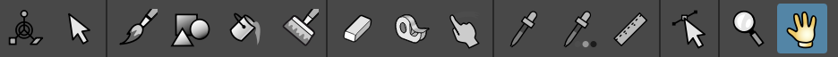
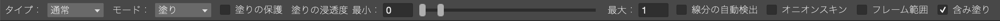
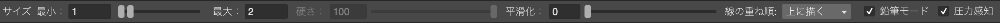

# ショートカットキー 一覧 

## ツールバー

| ツールバー                   | ショートカットキー |
| ---------------------------- | ------------------ |
| 編集ツール                   | ショートカットなし |
| 選択ツール                   | Ctrl+T             |
| ブラシツール                 | B                  |
| 図形ツール                   | U                  |
| 塗りつぶしツール(塗りモード) | G                  |
| 塗りつぶしツール(線モード)   | Shift+G            |
| ペイントブラシツール         | Y                  |
| 消しゴムツール               | E                  |
| 線繋ぎツール                 | T                  |
| 塗り伸ばしツール             | K                  |
| スポイトツール               | H                  |
| RGBスポイトツール            | I(アイ)            |
| ものさしツール               | J                  |
| フックツール                 | O                  |
| ズームツール                 | Alt+Space          |
| 回転ツール                   | Shift+Space        |
| 手のひらツール               | Space              |

## ツールオプション(塗り)

| タイプ:通常                                  | ショートカットキー |
| -------------------------------------------- | ------------------ |
| タイプ:通常                                  | Z                  |
| タイプ:長方形                                | X                  |
| タイプ:なげなわ                              | C                  |
| タイプ:多角形                                | V                  |
| モード:線                                    | A                  |
| モード:塗り                                  | S                  |
| モード:線と塗り                              | D                  |
| --------------------------------             | ----------------   |
| 塗りの保護                                   |                    |
| 塗りつぶしツール:含み塗り                    | Shift+F            |
| 現在のスタイルで含み塗りオプションを切り替え | Shift+A            |
| フレーム範囲                                 | F6                 |
| RGBスポイトツール:スクリーン上から拾う       | Shift+I(アイ)      |

## ツールオプション(ブラシ)

| ツールオプション(ブラシ)  | ショートカットキー |
| ------------------------- | ------------------ |
| ブラシサイズ:最小値を減少 | ;(セミコロン)      |
| ブラシサイズ:最小値を増加 | :(コロン)          |
| ブラシサイズ:最大値を減少 | [                  |
| ブラシサイズ:最大値を増加 | ]                  |
| 鉛筆モード                | Shift+B            |
| 消しゴムツール:反転       | Shift+E            |
| ブラシツール:圧力感知     | Shift+P            |

## トレース・タイムシート操作

| なにか           | ショートカットキー   |
| ---------------- | -------------------- |
| レベルの読み込み | F1                   |
| レベル設定       | F12                  |
| 線のみ表示       | Q                    |
| 透明度チェック   | Ctri+B               |
| ステップを下げる | -(マイナス)          |
| ステップを上げる | ^(ハット/キャレット) |
| 前の画像         | ,(カンマ)            |
| 次の画像         | .(ピリオド)          |
| 前のフレーム     | Shift+,(カンマ)      |
| 次のフレーム     | Shift+.(ピリオド)    |
| 前のキー         | Ctrl+,(カンマ)       |
| 次のキー         | Ctrl+.(ピリオド)     |
| 再生             | P                    |
| ループ再生       | L                    |

## ウィンドウ

| ウィンドウ             | ショートカットキー     |
| ---------------------- | ---------------------- |
| レベルビューア         | F8                     |
| スタイルエディタ       | F9                     |
| コマンドバー           | F10                    |
| ヒストリー             | F11                    |
| パネルを最大化         | `(バッククォート)      |
| 全画面モードに切り替え | Ctrl+`(バッククォート) |

## 視覚化(表示オプション)・カラム

| 視覚化(表示オプション)    | ショートカットキー  |
| ------------------------- | ------------------- |
| Reset Zoom                | Alt+0               |
| ウィンドウ全体を表示      | Alt+9               |
| ピクセル等倍              | N                   |
| 全画面の表示/ 非表示      | Alt+F               |
| オニオンスキン表示/非表示 | /(スラッシュ)       |
| 選択列をアンロック        | Alt+A               |
| 選択列をロック            | Alt+S               |
| 全ての列をアンロック      | Alt+Shift+A         |
| 全ての列をロック          | Alt+Shift+S         |
| 太さ0の線                 | Shift+/(スラッシュ) |

